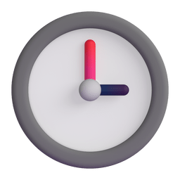

<div>
    
    <h1>Stopwatch for recording time</h1>
</div>

##### This app measures your time and creates graphs.
##### It can be used, for example, to mark study hours and follow your performance and progress through graphs.

<div>


</div>

### Requeriments:

<div style="display: flex; gap: 10px;">
    <a href="https://flet.dev/">
        
    </a>
    <a href="https://matplotlib.org/">
        
    </a>
    <a>
        
    </a>
</div>

<br/>

* To install external libraries run: 

```bash
pip install -r requeriments.txt
```
* How to use: When opening the app it will create a `study_data.json` file in your home directory, this file will contain the path where the text file with the saved times will be saved

* Buttons:
    - **Start**: Stopwatch starts counting;
    - **Stop**: stops the stopwatch counting;
    - **Reset**: resets the count;
    - **Save time**: this button appears when the stopwatch is stopped on it you save your time and it is saved in the txt file along with the current date and day of the week.
    - **Save icon**: Changes the location where the file with recorded times will be saved
    - **Chart icon**: Opens the graphics visualization window, being able to choose between bar and line graphs to visualize

#### Available to: 
<div style="display: block">
    
    
</div>

##### [Download here the executables](https://github.com/rianwilliam/study_time_tracker/releases/tag/1.0.0)

#### Social Media:

<div>
    <a href="mailto:rian99frelas@gmail.com">
        
    </a>
    </a>
    <a href="https://www.linkedin.com/in/rian-william-garcia-176180237/">
        
    </a>
    <a href="https://www.codewars.com/users/Rian%20William">
        
    </a>
</div>
